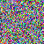

# Images

This page lists many images.

## Gamma

These are images of different gammas.

 
 
 
 
 

## Random

This is a image filled with random pixels.

## Effect

These are images of different effect.

 
 
 
 
 
 
 

## Graph

This is a image of trigonometric curve.

